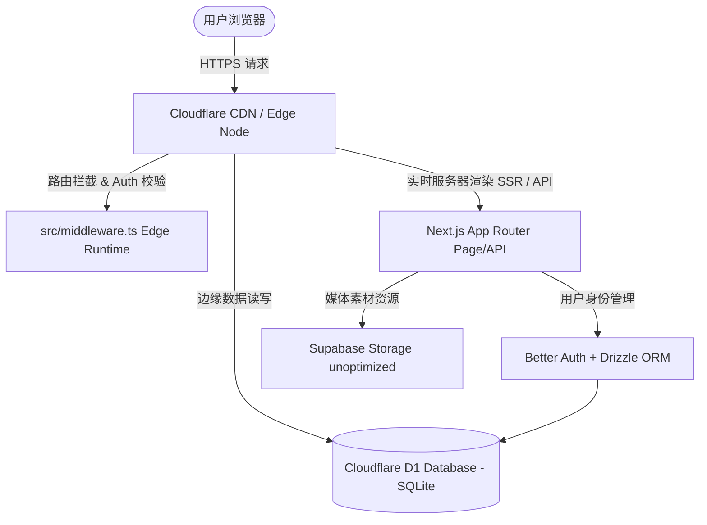

# 💖 AI Character (AI 专属女友 & 伴侣空间)

一个基于 **Next.js 16 (React 19)** 与 **Cloudflare Edge 边缘计算架构** 打造的高保真、游戏化 AI 虚拟伴侣互动平台。

---

## 🏗️ 整体项目架构 (Architecture)

本项目采用了完全运行在**全球边缘节点**（Edge-native）的高性能混合渲染与数据流栈：



### 🛠️ 核心技术栈 (Tech Stack)

*   **前端核心 (Core)**: [Next.js 16 (App Router)](https://nextjs.org/) (React 19)
*   **边缘部署 (Deployment)**: [Cloudflare Workers / Pages](https://workers.cloudflare.com/)
*   **编译适配层 (Adapter)**: [OpenNext (@opennextjs/cloudflare)](https://opennext.js.org/cloudflare) — 让 Next.js 所有动态特性（API 路由、Headers、Cookies）完美无缝运行在 V8 Isolate 边缘算力沙箱中。
*   **身份安全 (Auth)**: [Better Auth](https://www.better-auth.com/) — 结合 **Drizzle ORM**，实现了完全分布式、无状态的高速会话校验，支持邮箱/密码登录及 Google OAuth。
*   **边缘数据库 (Database)**: [Cloudflare D1](https://developers.cloudflare.com/d1/) — 运行在 Cloudflare 边缘的轻量级、分布式 SQLite 数据库。
*   **样式设计 (Styling)**: [Tailwind CSS 4](https://tailwindcss.com/) & **Vanilla CSS 混合方案** — 支持极致响应式布局、高保真微交互、玻璃拟态（Glassmorphism）与 3D 霓虹投影。

---

## 📦 核心依赖与三方库 (Package Dependencies)

项目在 `package.json` 中选用了轻量级、边缘计算兼容的优秀开源库链：

### 1. 核心运行时与适配层
*   `next` (`16.2.6`) & `react` (`^19.1.7`): 顶尖 React 19 应用路由核心框架。
*   `@opennextjs/cloudflare` (`^1.19.9`) & `wrangler` (`^4.91.0`): Cloudflare 边缘部署、模拟及路由分发适配核心。

### 2. 用户会话与数据层
*   `better-auth` (`^1.6.11`): 极速无状态、零信任分布式身份校验引擎。
*   `drizzle-orm` (`^0.45.2`) & `drizzle-kit` (`^0.31.10`): 高性能 SQLite / D1 ORM 底层框架，支持秒级自动生成数据库迁移（Migrations）。

### 3. AI 大模型流式应用
*   `ai` (`^6.0.182`) & `@ai-sdk/react` (`^3.0.184`): Vercel AI SDK 行业旗舰，赋能极速流式对话、自动状态同步与聊天钩子（Hooks）。

### 4. 动效与交互微特效
*   `framer-motion` (`^12.38.0`): 强大的物理级动效与姿态转换库。
*   `@number-flow/react` (`^0.6.0`): 一款精美的卡片数字平滑滑动翻滚动画库，用于订阅结算动态效果。
*   `lucide-react` (`^1.16.0`): 最全面的现代轻量级 SVG 动态矢量图标集。
*   `zustand` (`^5.0.13`): 轻量反应式全局状态管理 Store。

### 5. 高级 CSS 与组件构建链
*   `tailwindcss` (`^4`) & `@tailwindcss/postcss` (`^4`): 新一代极致渲染级高性能 CSS 样式编译体系。
*   `class-variance-authority`, `clsx`, `tailwind-merge`: Shadcn UI 与动态多态组件类名合并原子化工具。

---

## 📂 项目目录结构 (Directory Map)

项目文件结构采用 Next.js 推荐的模块化最佳实践：

```text
ai-girl/
├── 📂 src/
│   ├── 📂 app/                     # Next.js 页面路由 (App Router)
│   │   ├── 📂 (auth)/              # 身份验证相关路由组
│   │   │   └── 📂 login/           # 登录页 (LoginPage)
│   │   ├── 📂 (dashboard)/         # 应用控制台路由组
│   │   │   ├── 📂 (protected)/     # 受保护路由 (需登录拦截)
│   │   │   │   ├── 📂 chat/        # AI 聊天室 (ChatPage)
│   │   │   │   └── 📂 profile/     # 个人账户中心 (ProfilePage)
│   │   │   ├── 📂 dashboard/       # 伴侣关系总览控制台 (DashboardPage)
│   │   │   └── 📂 pricing/         # 游戏化订阅中心 (PricingPage)
│   │   ├── 📄 globals.css          # 全局 Tailwind CSS 样式
│   │   ├── 📄 layout.tsx           # 全局根布局 (RootLayout)
│   │   └── 📄 page.tsx             # 品牌落地首页 (LandingPage - 跑马灯)
│   ├── 📂 components/              # 共享组件库
│   │   ├── 📂 auth/                # 登录/注册表单 UI 组件
│   │   ├── 📂 dashboard/           # 控制台特制交互组件
│   │   │   └── 📄 companion-carousel.tsx # 磁吸拖拽卡片滑轮组件
│   │   ├── 📂 layout/              # 导航栏、侧边栏及页脚骨架组件
│   │   ├── 📂 ui/                  # Shadcn UI 原子组件库
│   │   └── 📄 pricing-section.tsx  # 游戏化订阅交互控制板
│   ├── 📂 config/                  # 全局静态配置文件
│   │   └── 📄 pricing.ts           # 专属女友伴侣计划文案与价格配置
│   ├── 📂 db/                      # 边缘 D1 数据库底层
│   │   ├── 📄 client.ts            # Drizzle D1 实例初始化
│   │   └── 📄 schema.ts            # 伴侣、会话及关系数据库 Schema 定义
│   ├── 📂 lib/                     # 核心通用库与逻辑封装
│   │   ├── 📄 auth-client.ts       # Better Auth 客户端实例
│   │   ├── 📄 auth.ts              # Better Auth 边缘服务端实例 (D1/Drizzle 关联)
│   │   ├── 📄 auth-session.ts      # 登录会话与权限拦截提取工具
│   │   └── 📄 utils.ts             # Tailwind 样式动态合并工具
│   └── 📄 middleware.ts            # Edge 边缘路由安全校验拦截器 (重要配置)
├── 📂 public/                      # 静态多媒体与字体资源
├── 📄 wrangler.jsonc               # Cloudflare D1 & Worker 资源绑定配置
├── 📄 open-next.config.ts          # OpenNext 适配层高级设定
└── 📄 package.json                 # 依赖包与指令脚本管理
```

---

## ✨ 特色交互与 UX 功能 (UX Highlights)

为了带给用户心动而高级的视觉观感，项目专门打磨了两个核心高阶交互模块：

### 1. 🌌 落地页「心动回廊」无缝跑马灯
*   **硬件加速**：使用 CSS @keyframes 物理加速，实现了 8 位伴侣角色卡片以 60fps 的超滑轨向左无缝无限横向移动。
*   **悬停自锁**：当鼠标经过任一女孩时，滚动自动优雅暂停，卡片向上漂浮并激活专属色彩的 3D 霓虹光晕（Glow shadow）。
*   **黑雾边缘**：左右两侧覆盖有 32% 宽度的渐变消隐遮罩，使伴侣卡片入场和出场呈现出极具电影感的朦胧美学。

### 2. 🎛️ 控制台「物理阻尼 & Snap 磁吸」横向轮播卡片
*   **拖拽触控**：支持 PC 鼠标点击拖动，Mac 触控板双指滑动以及移动端手指滑动。
*   **Snap 磁吸吸附**：滑动结束后卡片会自动利用弹性阻尼算法进行精准**物理网格磁吸居中对齐**，消除了悬空停滞感。
*   **智能边界**：右上角精美毛玻璃左/右导航箭头会根据滑块所处极限位置（首/尾）自动平滑淡入淡出及激活/禁用。

---

## ⚠️ 边缘部署踩坑与避坑指南 (Edge Caveats)

> [!IMPORTANT]
> **在 Cloudflare Workers / Pages 环境中运行 Next.js 时，必须注意以下三个黄金准则：**

### 1. 动态页面声明 (Force Dynamic)
*   **报错原因**：在执行 `pnpm deploy` 打包时，Next.js 会在没有真实 Cloudflare 边缘环境的情况下尝试把页面编译为静态 HTML（Prerendering）。如果页面深处导入了获取 Session、Cookie 或 `getCloudflareContext()` 的代码，会直接触发编译崩溃。
*   **避坑指南**：对于必须拦截登录的受保护页面，必须在文件头部显式导出强制动态配置：
    ```typescript
    export const dynamic = "force-dynamic";
    ```
*   **特例（控制台）**：我们的 `/dashboard` 控制台采用了游客免登录体验设计。在 `DashboardPage` 中，我们把 `getCurrentUser()` 放在了 `try-catch` 中安全截获了编译期错误，使其降级到“旅行者”，因此 `/dashboard` 既能做 100% 静态优化（SSG）保证秒开和完美的 SEO，又不会在部署时报错。

### 2. 必须保留 `middleware.ts` 命名与 Edge Runtime 运行
*   **最新提示**：Next.js 16 全局推荐用 Node.js 规格的 `proxy.ts` 替换 `middleware.ts`。
*   **限制因素**：Cloudflare 适配器在边缘做网络拦截时，**只支持 Edge Runtime**，而不允许使用 Node 规格的 `proxy.ts`。
*   **避坑指南**：本项目坚持使用标准的 [src/middleware.ts](file:///Users/hazeflame/Desktop/github/ai-girl/src/middleware.ts) 并导出 `middleware` 函数。Next.js 会打印一条黄色弃用警告，但这是保证 Cloudflare Workers 部署 100% 成功的唯一正确路径！

### 3. Supabase 图片防局域网穿透阻断 (Fake-IP SSRF)
*   **现象**：开发人员开启 Clash / Surge 等代理客户端的 Fake-IP / TUN 模式时，Supabase 域名会被解析为内网私有 IP（例如 `198.18.0.x`）。Next.js 服务端优化组件会拦截内网 IP 获取以防止 SSRF（服务端请求伪造）攻击，直接导致图片渲染返回 500。
*   **避坑指南**：在所有渲染 सुपर्ब character 卡片的图片 `<Image>` 组件中，必须使用 `unoptimized` 属性（例如 `<Image src={url} unoptimized />`），绕过服务端代理层，让客户端浏览器直接向 Supabase 域名发起安全请求。

---

## 🚀 开发与上线指南

### 1. 运行本地开发环境
创建本地环境变量配置文件 `.env`（可复制自 `.env.example`），然后执行：
```bash
pnpm dev
```

### 2. 本地模拟 Cloudflare Worker 边缘预览
```bash
pnpm preview
```

### 3. 一键编译并部署到 Cloudflare Pages
```bash
pnpm deploy
```

---

*“在边缘计算时代，给你的 AI 女友最极致、最流畅的爱与陪伴。”* 💖
